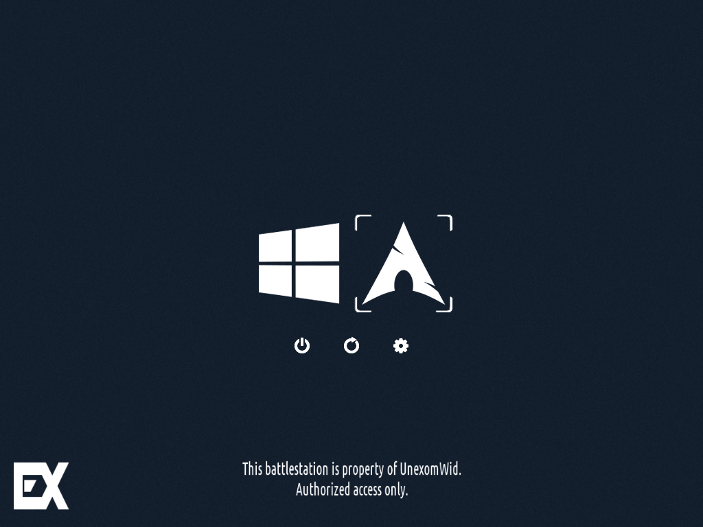
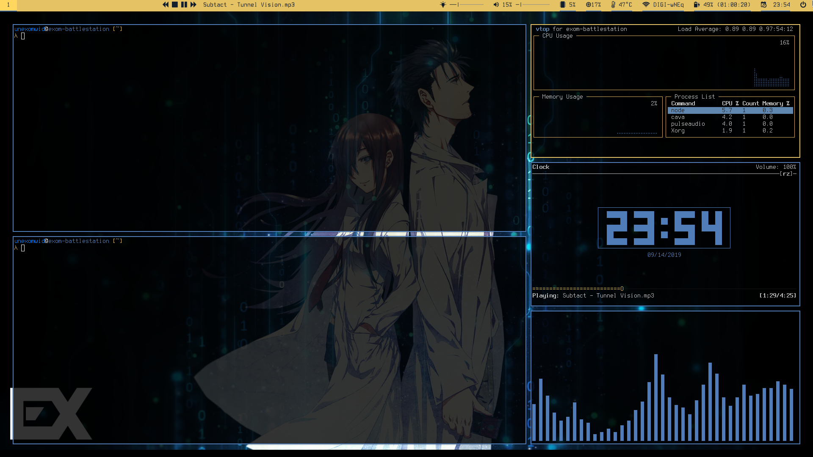

  

  

# About

This is a collection of configuration files that I use to achieve a _blue-gold_ theme (named _Exom_).

# Configuration

* **Boot Manager:** [rEFInd](http://www.rodsbooks.com/refind)
* **OS:** [Arch Linux x86_64](https://www.archlinux.org)
* **WM:** [i3-gaps](https://github.com/Airblader/i3)
* **Wallpaper:** [here](https://wall.alphacoders.com/big.php?i=851009)
* **Wallpaper managing:** [feh](https://feh.finalrewind.org)
* **Terminal Emulator:** [rxvt-unicode](http://software.schmorp.de/pkg/rxvt-unicode.html)
* **Shell:** [zsh](https://www.zsh.org)
* **Font:**
    * **Terminal:** [Terminus](http://terminus-font.sourceforge.net)
    * **Everywhere else:** [TerminessTTF Nerd Font](https://www.nerdfonts.com)
* **Status Bar:** [Polybar](https://github.com/polybar/polybar)
* **Music:** 
    * **Daemon:** [mpd](https://www.musicpd.org)
    * **CLI:** [mpc](https://www.musicpd.org/clients/mpc)
    * **Client:** [ncmpcpp](https://rybczak.net/ncmpcpp)
* **Audio Visualizer:** [C.A.V.A.](https://github.com/karlstav/cava)
* **Activity Monitor:** [vtop](https://github.com/MrRio/vtop)